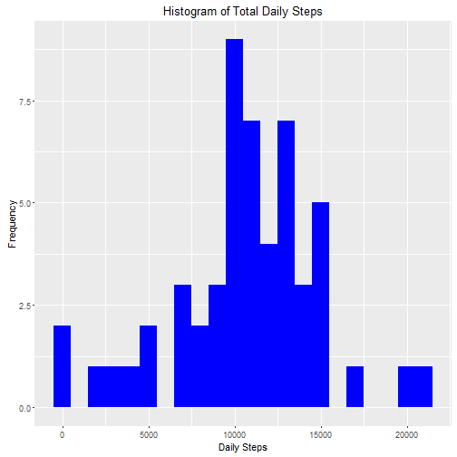
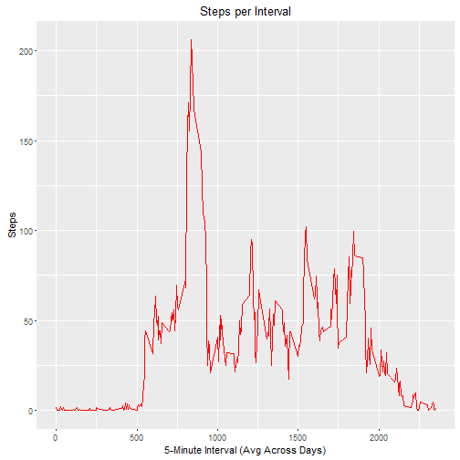
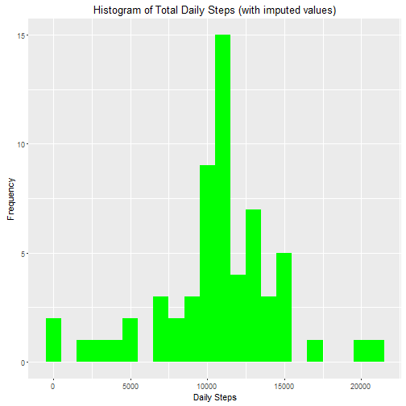
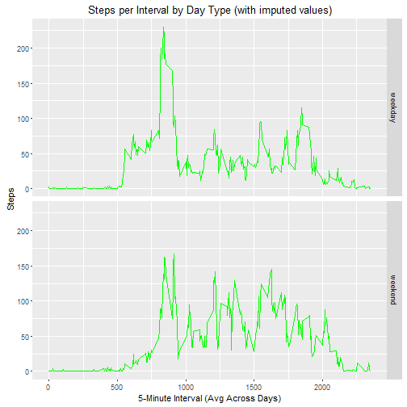

# Reproducible Research, Course Project #1
===========================================

## Loading & Processing Data

I loaded the .csv file with the code as shown:


```r
raw <- read.csv("activity.csv", colClasses = c("numeric", "character", "integer"))
```

This assumes the activity.csv file is on the local working directory.

## Mean Total Number of Steps per Day

The code below generates output showing the mean total number of steps taken per day.  Missing values in the dataset were ignored.


```r
library(dplyr)
```

```
## 
## Attaching package: 'dplyr'
```

```
## The following objects are masked from 'package:stats':
## 
##     filter, lag
```

```
## The following objects are masked from 'package:base':
## 
##     intersect, setdiff, setequal, union
```

```r
daysumtot <- raw %>% filter(!is.na(steps)) %>% group_by(date) %>% summarize(steps = sum(steps, na.rm = TRUE)) 
```

This is a histogram showing the total number of steps taken each day.


```r
library(ggplot2)
histdaytot <- ggplot(daysumtot, aes(x=steps)) + geom_histogram(fill = "blue", binwidth = 1000) + labs(title = "Histogram of Total Daily Steps", x = "Daily Steps", y = "Frequency")
print(histdaytot)
```



```r
meandaytotal <- mean(daysumtot$steps, na.rm = TRUE)
meddaytotal <- median(daysumtot$steps, na.rm = TRUE)
```

Mean of daily steps: 1.0766189 &times; 10<sup>4</sup>  
Median of daily steps: 1.0765 &times; 10<sup>4</sup>  

## Average Daily Activity Pattern  

The average daily activity pattern is shown in the time series plot below.  The interval is marked by the beginning of the time interval in which the steps occurred.

```r
stepsmeanint <- raw %>% filter(!is.na(steps)) %>% group_by(interval) %>% summarize(steps = mean(steps, na.rm = TRUE))
stepsint <- ggplot(stepsmeanint, aes(x=interval, y=steps)) + geom_line(col = "red") + labs(title = "Steps per Interval", x = "5-Minute Interval (Avg Across Days)", y = "Steps")
print(stepsint) 
```



```r
intmax <- stepsmeanint[which.max(stepsmeanint$steps),"interval"]
```

Interval # 835 contains the maximum number of steps.

## Imputing missing values


```r
missval <- colSums(is.na(raw))
```

The total number of missing values in each dataset column (steps, date, interval) is 2304, 0, 0.

Missing values will be filled in by calculating the mean for that 5-minute interval across all days.  The code to do that is below.


```r
rawtot <- raw
for (i in 1:nrow(rawtot)) {
        if (is.na(rawtot$steps[i])) {
                m <- match(rawtot$interval[i], stepsmeanint$interval)
                rawtot$steps[i] <- stepsmeanint$steps[m]
        } 
}
natest <- colSums(is.na(rawtot))    # post-test for NAs
```

After the code executes, the number of NAs in each column (steps, date, interval) is found to be 0, 0, 0 and the updated dataset is:


```r
head(rawtot)
```

```
##       steps       date interval
## 1 1.7169811 2012-10-01        0
## 2 0.3396226 2012-10-01        5
## 3 0.1320755 2012-10-01       10
## 4 0.1509434 2012-10-01       15
## 5 0.0754717 2012-10-01       20
## 6 2.0943396 2012-10-01       25
```

A histogram is shown below, with imputed values in place of the missing ones.  We see from these values that there is not much difference.  The new mean and median are equal to each other and equal to the previous mean of the histogram with missing values.


```r
daysumtot1 <- rawtot %>% filter(!is.na(steps)) %>% group_by(date) %>% summarize(steps = sum(steps, na.rm = TRUE))
histdaytot1 <- ggplot(daysumtot1, aes(x=steps)) + geom_histogram(fill = "green", binwidth = 1000) + labs(title = "Histogram of Total Daily Steps (with imputed values)", x = "Daily Steps", y = "Frequency")
print(histdaytot1)
```



```r
meandaytotal1 <- mean(daysumtot1$steps, na.rm = TRUE)
meddaytotal1 <- median(daysumtot1$steps, na.rm = TRUE)
```
Updated mean daily total:   1.0766189 &times; 10<sup>4</sup>  
Updated median daily total: 1.0766189 &times; 10<sup>4</sup>

## Differences in Activity Patterns, Weekdays vs. Weekends

Weekdays show more activity in the morning hours between 8am and 10am than do weekends.  The volatility of activity is greater during the weekday than the weekend.  The code and time series, panel plots are shown below.


```r
rawtotwk <- rawtot %>% mutate(day= weekdays(as.Date(date)), daytype = ifelse(day %in% c("Saturday","Sunday"),"weekend","weekday"))
rawtotwk$daytype <- as.factor(rawtotwk$daytype)

stepsmeanint1 <- rawtotwk %>% filter(!is.na(steps)) %>% group_by(interval, daytype) %>% summarize(steps = mean(steps, na.rm = TRUE))

stepsint1 <- ggplot(stepsmeanint1, aes(x=interval, y=steps)) + geom_line(col = "green") + labs(title = "Steps per Interval by Day Type (with imputed values)", x = "5-Minute Interval (Avg Across Days)", y = "Steps") + facet_grid(daytype~.)
print(stepsint1)  
```



